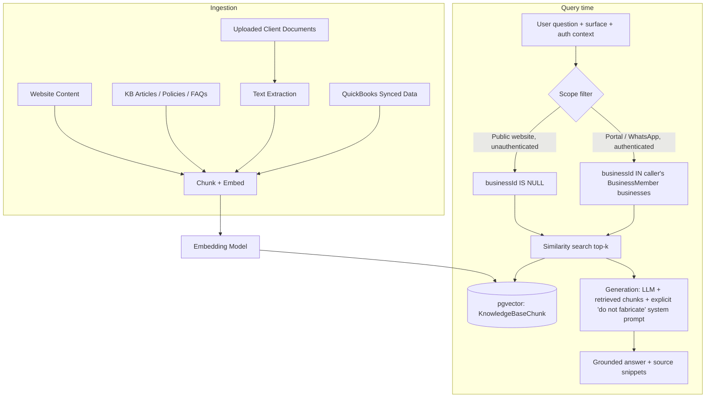

# AI / RAG Architecture

## Principle

Every AI answer, on every surface, is grounded in retrieved content — never freeform generation. The same retrieval + generation pipeline (`AiService`) backs the website assistant, the portal assistant, and the WhatsApp AI Financial Assistant; what differs per surface is the **scope** of what can be retrieved.

## Ingestion

- **Website content** — marketing pages, FAQ, service descriptions are chunked at build/publish time.
- **Knowledge base** — internal policy/FAQ articles authored by RelaTax staff (Admin Portal → Knowledge Base management, Phase 2 UI).
- **Client documents** — on upload, `DocumentsService` triggers an async indexing job (BullMQ) that extracts text (PDF/Word/Excel) and stores chunks with `businessId` set, so retrieval is automatically scoped.
- **QuickBooks synced data** — summarized (not raw ledger rows) into chunks describing period-over-period changes, so the AI can explain "why is my VAT higher" without being handed the entire transaction table.

## Retrieval & guardrails

| Surface | Scope filter | Notes |
|---|---|---|
| Website assistant (unauthenticated) | `businessId IS NULL` (public KB + marketing content only) | Never sees client data; explicitly instructed to redirect to WhatsApp/consultation for anything account-specific |
| Client Portal assistant | Public KB + `businessId` in caller's memberships | Can explain the client's own uploaded documents/reports |
| WhatsApp AI Assistant | Public KB + the session's `activeBusinessId` only | Never the client's *other* businesses, even if they have several — must explicitly switch business first |

Every generation call includes a system-level instruction to answer **only** from the provided context and to say "I don't have that information — I can connect you with a consultant" rather than guess, plus a hard stop on financial advice framed as personalized investment recommendations (redirect to a licensed advisor).

## Provider selection

Retrieval and generation are decoupled, and generation is swappable at runtime by env var — no caller changes:

- **Retrieval** always runs on real pgvector cosine-similarity over the knowledge base. Embeddings are currently the deterministic local hash embedder; because Anthropic has **no embeddings endpoint**, moving to real semantic embeddings is a separate swap to a dedicated embeddings provider (e.g. Voyage or OpenAI) and does not depend on the generation provider below.
- **Generation** has two implementations behind `AiService.chat()`:
  - `MockAiService` (default) — a template-based grounded responder that assembles the retrieved chunks + numeric context into a readable answer. No external call; the whole pipeline is demonstrable offline.
  - `AnthropicAiService` — real Claude generation via the official `@anthropic-ai/sdk`. It reuses the pgvector retrieval, passes the top-scoring chunks + the client's own figures to Claude under a strict grounding system prompt (answer only from context, never fabricate, redirect to a consultant when unsure, no personalized investment advice), and falls back to the grounded excerpt if the API call fails.
- **Selecting Claude**: set `AI_PROVIDER=anthropic` and `ANTHROPIC_API_KEY=<key>` (optionally `AI_MODEL`, default `claude-opus-4-8`) in `apps/api/.env`, then restart the API. With no key set it stays on the mock, so local dev needs no credentials. The provider chosen is logged at boot (`AiModule: AI generation provider: …`).
