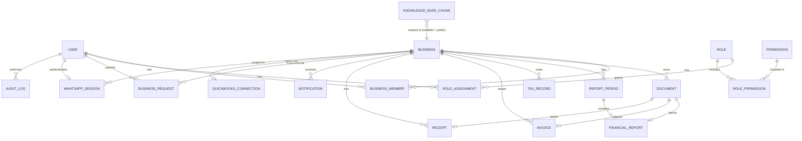

# Entity-Relationship Diagram

Source of truth: [`apps/api/prisma/schema.prisma`](../../apps/api/prisma/schema.prisma). This document explains the model; the schema is authoritative.

## Entities

| Entity | Purpose | Key fields |
|---|---|---|
| `User` | A person who signs in — a client or a staff member. | `email`, `phone`, `passwordHash`, `isStaff` |
| `Business` | One of a client's companies. Has its own branding/logo. | `name`, `logoUrl`, `status` (`pending`/`active`/`archived`) |
| `BusinessMember` | Join table: which users can access which businesses, and as what (owner/staff-assigned). | `userId`, `businessId`, `role` |
| `Role` / `Permission` / `RolePermission` | RBAC: 7 roles, each granted a set of permissions (view/create/edit/delete/upload/download/approve/manage_users). | see [Roles Matrix](roles-permissions-matrix.md) |
| `RoleAssignment` | Which staff `User` holds which `Role`. | `userId`, `roleId` |
| `Document` | Any uploaded file (PDF/Excel/Word/CSV/image/zip), categorized and assigned. | `businessId`, `category`, `reportType`, `periodId`, `storageKey`, `mimeType` |
| `ReportPeriod` | A reporting period (e.g. 01/01/2026–31/05/2026, or a month/quarter/year shorthand). | `businessId`, `startDate`, `endDate`, `label` |
| `FinancialReport` | A generated/uploaded report tied to a period and type (P&L, Balance Sheet, Cash Flow, Trial Balance, VAT, PAYE, Corp Tax, Draft, Custom). | `periodId`, `type`, `documentId`, `source` (`quickbooks`/`manual`/`draft`) |
| `TaxRecord` | Tax due/paid/penalty/filing-deadline entries per business per period. | `businessId`, `taxType`, `amountDue`, `amountPaid`, `penalty`, `dueDate`, `status` |
| `Invoice` / `Receipt` | Client-facing financial documents, optionally backed by an uploaded `Document`. | `businessId`, `documentId`, `amount`, `issuedAt` |
| `Notification` | Reminders/announcements/completion notices, delivered to portal + WhatsApp + email. | `businessId`, `userId`, `type`, `channel[]`, `readAt` |
| `BusinessRequest` | The "Add Business" flow: client requests, admin creates, client is notified. | `requestedByUserId`, `status`, `notes`, `createdBusinessId` |
| `QuickBooksConnection` | One OAuth2 connection per business. | `businessId`, `realmId`, `accessToken`, `refreshToken`, `expiresAt`, `lastSyncedAt` |
| `WhatsAppSession` | An authenticated WhatsApp conversation: phone number, active business, current menu state, memory. | `phone`, `userId`, `activeBusinessId`, `state`, `context` (JSON), `expiresAt` |
| `AuditLog` | Immutable record of logins, uploads, downloads, edits, permission changes, notifications sent. | `userId`, `action`, `entityType`, `entityId`, `metadata`, `createdAt` |
| `KnowledgeBaseChunk` | A chunk of embeddable text (website content, KB articles, policy docs) with its vector, optionally scoped to one business for private RAG context. | `content`, `embedding (vector)`, `sourceType`, `businessId` (nullable) |

## Design notes

- **Multi-business per client** is modeled as `BusinessMember`, not a single `ownerId` column, so a business can later support more than one authorized user (e.g. an owner and their bookkeeper) without a schema change.
- **Reporting periods are first-class rows**, not just date filters, so a report request from the portal, the admin upload form, and a WhatsApp "Reports" flow all resolve to the same `ReportPeriod` row and the same underlying `FinancialReport`.
- **`KnowledgeBaseChunk.businessId` is nullable**: `null` means public website/KB content (usable by the unauthenticated website assistant); a set value means it's private, client-specific context (financial statements, uploaded docs) — the retrieval query in [AI/RAG Architecture](ai-rag-architecture.md) always filters by the requesting session's permitted `businessId`s.
- **`AuditLog` is append-only** — no update/delete path is exposed at the API layer, enforced by the `AuditLogInterceptor` writing directly, never through a user-facing endpoint.
