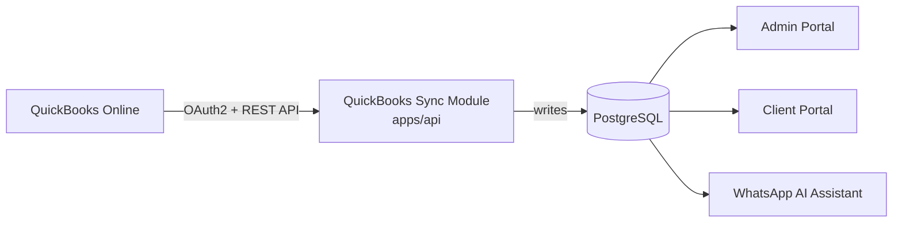

# QuickBooks Integration

## Data flow

Data always flows QuickBooks → RelaTax's own database first. No surface calls the QuickBooks API directly — the portal, admin, and WhatsApp all read RelaTax's normalized tables, so a QuickBooks outage or rate-limit never breaks the client-facing surfaces (they just show the last successful sync's data, with a visible "last synced" timestamp).

## OAuth2 flow

1. Admin (Finance/Admin role) initiates connection from the Admin Portal: `GET /businesses/:id/quickbooks/connect` redirects to Intuit's OAuth consent screen.
2. Intuit redirects back to `GET /quickbooks/callback` with an authorization code and `realmId`.
3. Backend exchanges the code for access + refresh tokens, stores them (encrypted at rest) in `QuickBooksConnection`.
4. Access tokens are refreshed automatically (~55 min expiry) by a scheduled job; refresh token rotation (100-day expiry) is monitored and flagged if it approaches expiry without renewal.

## Sync design

- **Trigger**: scheduled (e.g. every 4 hours) + manual "Sync now" from the Admin Portal.
- **Job**: a BullMQ job per business per sync, pulling `CompanyInfo`, `Customer`, `Vendor`, `Invoice`, `Payment`, `Purchase` (expenses), and report endpoints (`ProfitAndLoss`, `BalanceSheet`, `TrialBalance`) via the Intuit Reports API.
- **Mapping**: QuickBooks report rows are transformed into RelaTax's `FinancialReport` + `ReportPeriod` rows (`source: "quickbooks"`), and `Invoice`/transaction objects into RelaTax's `Invoice`/`TaxRecord`-relevant rows.
- **Conflict resolution**: QuickBooks is the system of record for QBO-native objects (invoices, P&L, balance sheet) — a sync always overwrites RelaTax's `source: "quickbooks"` rows for that period. Manually uploaded/draft reports (`source: "manual"` / `"draft"`) are never touched by sync, so an accountant's draft isn't silently clobbered by the next sync.
- **Retry**: exponential backoff (BullMQ default), max 5 attempts, then the job is marked `failed` and surfaced in the Admin sync log with the Intuit error payload.
- **Sync log**: every sync run (`SyncLog`, tracked per business) records `startedAt`, `finishedAt`, `status`, `recordsUpserted`, `error`.

## Known QuickBooks Online API limitations

- **No native VAT/PAYE/Corporation Tax objects.** QBO's tax framework is US/UK/AU/CA-centric; Kenyan tax types (VAT, PAYE, Corporation Tax, KRA filings) have no first-class QBO equivalent. **Recommendation**: these remain RelaTax-native `TaxRecord` entries, optionally cross-referenced to QBO transactions for the underlying taxable amounts, rather than forced into QBO's tax fields.
- **Rate limits**: 500 requests/minute per realm (app-wide), with additional per-minute throttling on Reports endpoints. **Recommendation**: batch report pulls, cache aggressively, and stagger scheduled syncs across businesses rather than syncing all businesses at the same instant.
- **Reports API is read-only and point-in-time** — there's no webhook for "P&L changed." **Recommendation**: rely on the scheduled poll plus QBO's entity webhooks (Invoice/Payment/Purchase create/update) to trigger an earlier targeted re-sync rather than waiting for the next scheduled window.
- **Sandbox vs Production apps** require separate Intuit Developer app registrations and separate OAuth credentials — the connector config supports both via environment-scoped client IDs.

## Implementation seam

`QuickBooksConnector` (interface) → `MockQuickBooksConnector` (Phase 1, returns fixture P&L/Balance Sheet data so the sync job, admin UI, and downstream reports flow are fully exercisable) → `IntuitQuickBooksConnector` (Phase 2, real API calls). Swapping the binding in `QuickbooksModule` is the only change needed to go live.
