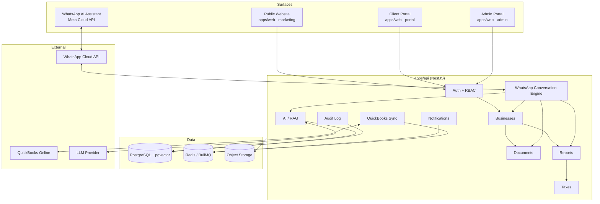

# System Architecture

## Principle

RelaTax is **one backend, four surfaces** — not four applications that happen to share a name. Every surface calls the same API, reads and writes the same database, enforces the same permission system, and answers questions from the same knowledge base.

## Why this shape

- **Single API, single source of truth.** A client's tax balance, a report PDF, or a document upload is the same row in the same Postgres database no matter which surface reads it. There is no per-surface database or duplicated business logic — each surface is a thin client over `apps/api`.
- **WhatsApp is not bolted on.** The WhatsApp conversation engine (`apps/api/src/whatsapp`) calls the exact same `BusinessesService`, `ReportsService`, `DocumentsService`, and `AiService` that the portal's REST controllers call. A WhatsApp reply and a portal dashboard card can never drift apart because they're generated by the same code path.
- **RBAC is enforced once, at the API boundary**, via Nest guards (`@Roles`, `@Permissions`) reading from the `Role`/`Permission` tables — not re-implemented per frontend.
- **Storage and AI are abstracted behind interfaces** (`StorageService`, `AiService`, `WhatsAppTransport`, `QuickBooksConnector`) so Phase 1 can ship with local/mock implementations and Phase 2 swaps in S3, a real LLM, the real Meta Cloud API, and the real Intuit API without touching calling code.

## Tech stack

| Layer | Choice | Why |
|---|---|---|
| Public site + Client Portal | Next.js 14 (App Router), TypeScript | SSR/SEO for marketing pages, one app for both since the site nav routes directly into portal login |
| Admin Portal | Next.js 14 (App Router), separate app | Clean security/deploy boundary — different audience, different origin, can be network-restricted independently |
| Backend | NestJS, TypeScript | Opinionated module/DI structure scales well to 10+ domain modules maintained by a team |
| Database | PostgreSQL 16 + `pgvector` | One relational store for business data and vector embeddings — no separate vector DB to keep in sync |
| ORM | Prisma | Type-safe schema is the ERD source of truth; migrations are reviewable diffs |
| Queue / Cache | Redis + BullMQ | Background jobs (QuickBooks sync, notifications, AI indexing, WhatsApp sends) with retries and backoff |
| Object storage | S3-compatible (MinIO locally, S3 in prod) | Documents/reports never touch the app servers' disk |
| Auth | JWT (access + refresh) + phone OTP | OTP is shared by WhatsApp login and portal MFA-lite; JWT keeps API stateless |
| Messaging | WhatsApp Business Cloud API (Meta) | List Messages + Reply Buttons for the conversational menu system |
| Accounting sync | QuickBooks Online API (OAuth2) | Client's existing books stay the system of record for QBO-native objects |
| AI | RAG over pgvector + an LLM provider | Grounded answers; the LLM is swappable behind `AiService` |

## Module boundaries (apps/api)

Each domain is a Nest module with its own controller/service/DTOs. Cross-cutting concerns (`AuditLogInterceptor`, `RolesGuard`, `JwtAuthGuard`) wrap all of them rather than being duplicated inside each module. See [API Design](api-design.md) for the resource map and [ERD](erd.md) for the data model each module owns.
