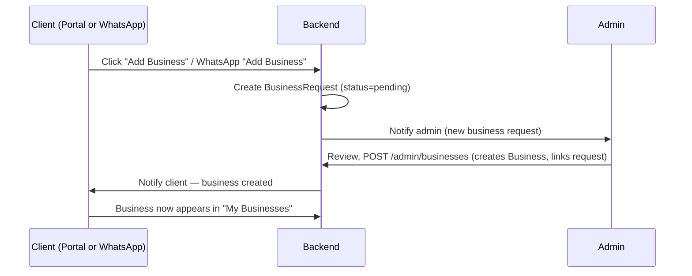
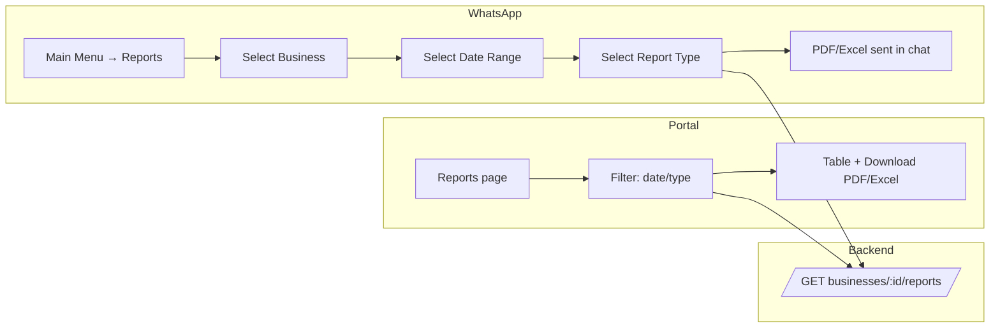
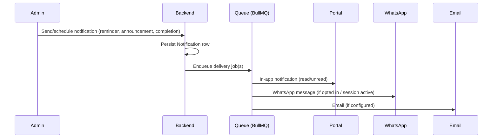

# UX Flows

## Add Business

The client never creates a business directly — this is intentional (RelaTax staff must review and provision each business).

## Report retrieval — compared across surfaces

Both paths call the identical `ReportsService.findReports(businessId, filters)` — the portal renders it as a table, WhatsApp renders it as a document message. Same data, same permissions, same source.

## Notification lifecycle

Delivery channels are independent queue jobs so a WhatsApp send failure (e.g. session expired) doesn't block the portal or email delivery — each retries on its own backoff, logged individually.

## Client onboarding (first login)

1. Admin creates the client's first `Business` (via the Add Business flow above, or direct admin creation for a new engagement).
2. Client receives an invite email with a set-password link.
3. Client logs in → sees their one business, no switcher needed yet.
4. Dashboard shows empty states with clear next actions ("No documents yet — your accountant will upload your first report shortly") rather than blank tables.
5. As soon as a second business is approved, the business switcher appears automatically — no separate "enable multi-business" step.

## WhatsApp-specific flows

See [WhatsApp Conversation Flows](whatsapp-flows.md) for the full authenticated menu system, which mirrors the portal's information architecture (Businesses → Reports/Taxes/Invoices/Receipts/Notifications/Documents/AI/Consultation) but expressed as List Messages and Reply Buttons instead of pages.
