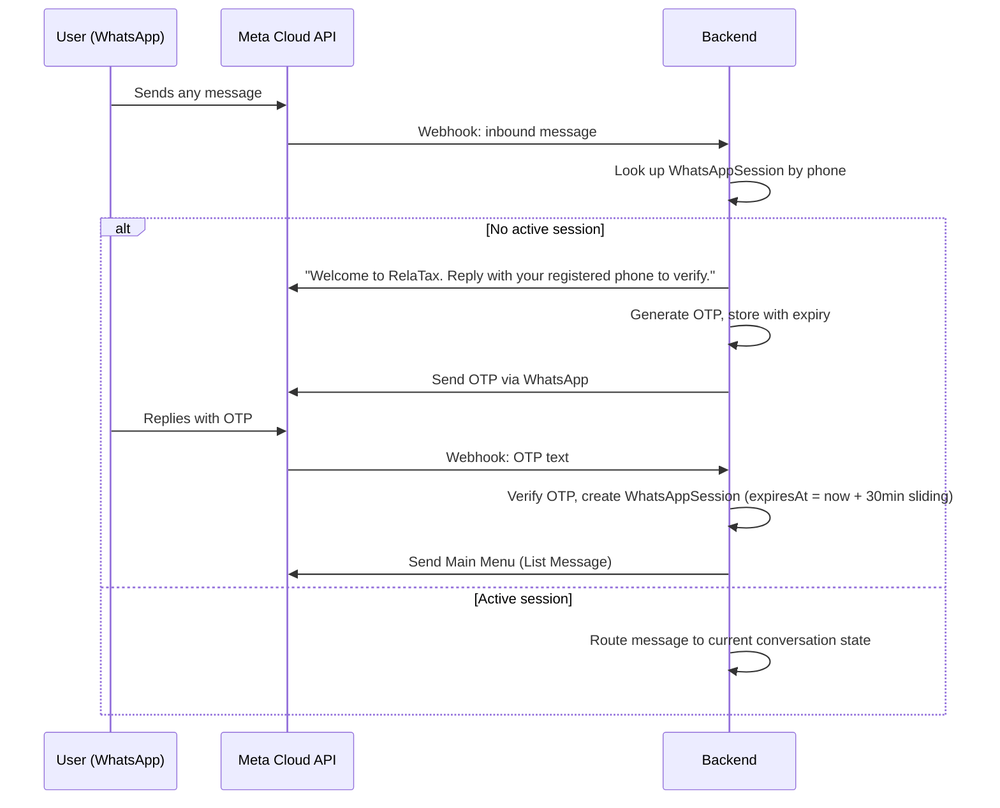
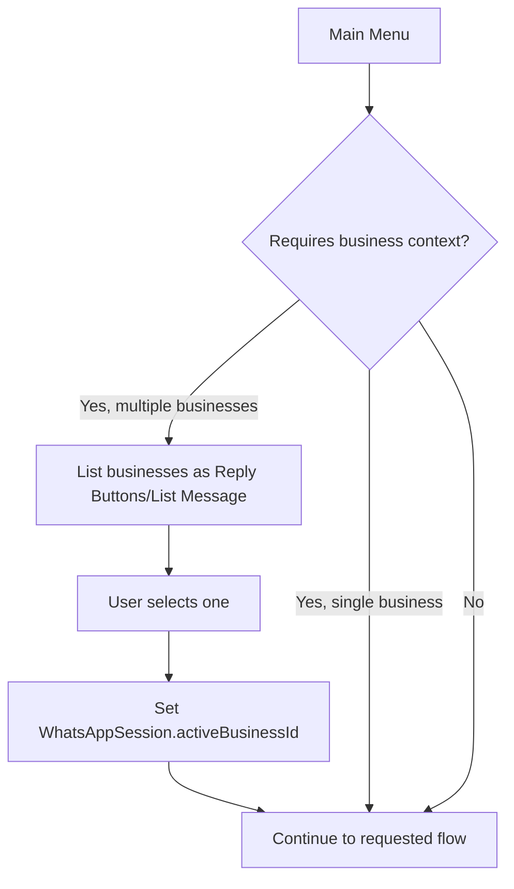
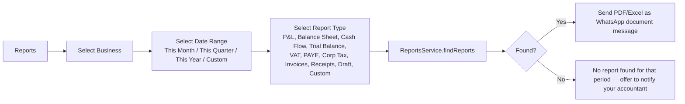
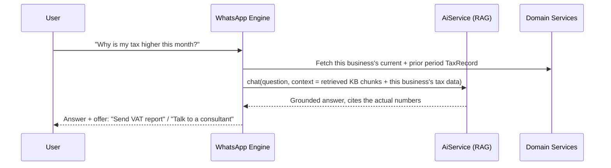

# WhatsApp Conversation Flows

The WhatsApp AI Assistant is a conversational client portal, not a FAQ bot. It is built as an explicit state machine (`WhatsAppConversationEngine`) so every step is deterministic and testable — the AI is used *inside* specific steps (the "Ask AI" flow, and explaining report data), not as a free-form agent guessing what to do next.

## Authentication



Sessions slide (renewed on each message) and hard-expire after inactivity; an expired session drops back to the OTP step, never leaking the last-viewed business's data to a new/different sender on the same number.

## Main Menu (List Message)

```
📋 RelaTax Assistant
1. My Businesses
2. Reports
3. Taxes
4. Invoices
5. Receipts
6. Notifications
7. My Documents
8. Ask AI
9. Book Consultation
10. Contact RelaTax
```

## Business selection



`activeBusinessId` persists for the rest of the session — subsequent menu picks (Reports, Taxes, etc.) don't re-ask unless the user explicitly picks "Switch Business."

## Reports flow



## Taxes, Invoices, Receipts, Documents, Notifications

Each is a shallow flow: Main Menu → (business context, reused if already set) → the same backend query the portal uses, rendered as WhatsApp text/list/document:
- **Taxes** — Due / Paid / Outstanding / Penalties / Upcoming Filing Dates / History, each a List Message option calling `TaxesService`.
- **Invoices & Receipts** — list recent, user picks one, backend sends the underlying `Document` as a WhatsApp document message.
- **My Documents** — category picker (Financial Statements, Invoices, Receipts, Drafts, Other) → list → send.
- **Notifications** — unread list with mark-as-read on view.

## AI Financial Assistant



The AI is never given free rein over the database — it receives only the specific, permission-scoped data the current flow already fetched, plus retrieved KB chunks. It cannot query anything the user isn't authorized to see, and it never fabricates a number it wasn't given.

## Escalation

Any flow can bail out to:
- **Chat with consultant** — creates a support ticket / notifies the assigned Accountant.
- **Book consultation** — same booking flow as the website.
- **Schedule callback** — captures a preferred time, notifies admin.

Triggered automatically when the AI's retrieval confidence is low (no relevant KB/business-data match), or explicitly when the user types "talk to a human" at any point.

## Conversation memory

`WhatsAppSession.context` (JSON) holds: `activeBusinessId`, `currentReportPeriod`, `recentRequests[]` (last 5). This is scoped to the session and cleared on expiry/logout — it is working memory for the current conversation, not a permanent profile. Typing `menu` at any point returns to the Main Menu from anywhere; deeper single-step "back" navigation (e.g. Reports date range → back to business selection) is a Phase 2 UX refinement, not yet implemented.

## Activation: real Meta Cloud API

`MetaWhatsAppTransport` (real Graph API sends) and webhook signature verification are implemented behind the same `WhatsAppTransport` interface the mock uses — no conversation-engine changes needed. This is a **credential swap only**, but the credential itself can only be obtained by RelaTax's own Meta account owner; it cannot be generated by a third party. Steps (from Meta's WhatsApp Cloud API "Get Started" guide):

1. **Create a Meta App** at the Meta App Dashboard, selecting the "Connect with customers through WhatsApp" use case, under a Meta Business Portfolio (new or existing).
2. **Connect a WhatsApp Business Account** in API Setup — link an existing one or create a new one; this assigns the WhatsApp Business Account ID.
3. **Generate a temporary token** to send a first test message and obtain a test **Phone Number ID**.
4. **Create a System User** in Business Settings, assign it the app + WhatsApp account, and generate a **permanent access token** with `business_management`, `whatsapp_business_messaging`, and `whatsapp_business_management` permissions — this replaces the temporary token for production.
5. Set in `apps/api/.env`: `WHATSAPP_TRANSPORT=meta`, `WHATSAPP_ACCESS_TOKEN` (the permanent token), `WHATSAPP_PHONE_NUMBER_ID`, and `WHATSAPP_APP_SECRET` (from the app's Basic Settings — used to verify the `X-Hub-Signature-256` header on every inbound webhook). Point the Meta App Dashboard's webhook URL at `https://<your-deployed-domain>/api/v1/whatsapp/webhook` with `WHATSAPP_VERIFY_TOKEN` matching the verify-token configured there.

The dev-only `/whatsapp/simulate-inbound` endpoint is automatically disabled once `WHATSAPP_TRANSPORT=meta`. A public HTTPS URL (i.e. a real deployment, not localhost) is required for step 5 — Meta cannot reach a local dev server.
